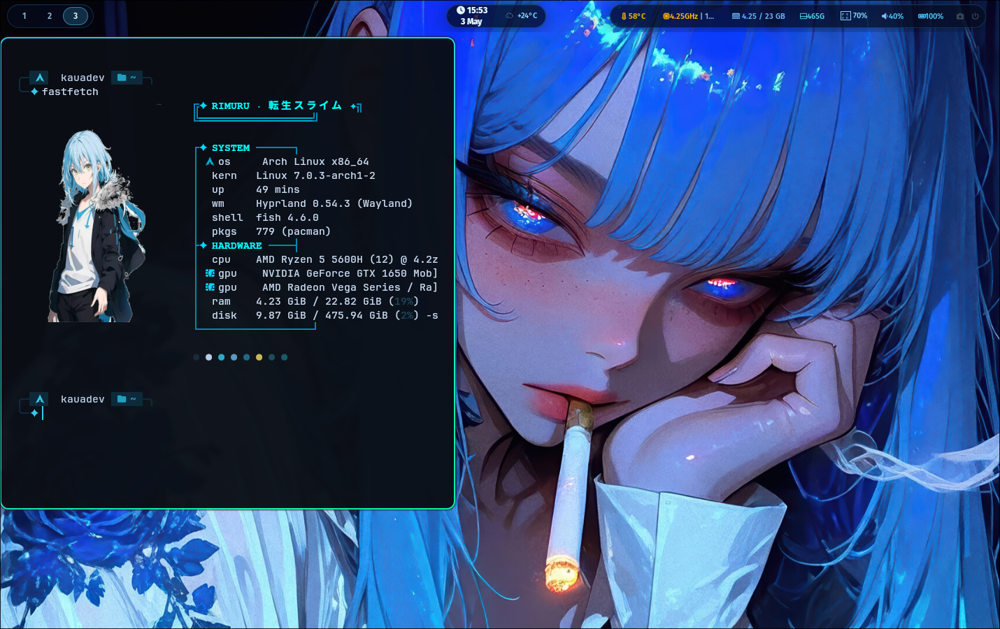

<div align="center">

# 🌌 dotfiles


**TESTADO EM ARCHLINUX E CACHYOS TOTALMENTE FUNCIONAL**

**Setup pessoal do Hyprland rodando no CachyOS** 
*Simples, funcional e agradável aos olhos.*




[](https://cachyos.org/)
[](https://hyprland.org/)
[](https://fishshell.com/)
[](LICENSE)

</div>

---

## 💻 Setup

| Componente | Ferramenta |
|---|---|
| 🐧 **Sistema Operacional** | [CachyOS](https://cachyos.org/) / Arch Linux / Fedora / openSUSE / Debian / Ubuntu |
| 🪟 **Window Manager** | [Hyprland](https://hyprland.org/) |
| 🐟 **Shell** | [Fish](https://fishshell.com/) + [Starship](https://starship.rs/) |
| 📟 **Terminal** | [Kitty](https://sw.kovidgoyal.net/kitty/) / [Alacritty](https://alacritty.org/) |
| ✏️ **Editor** | [Micro](https://micro-editor.github.io/) / VS Code |
| 🔔 **Notificações** | [Mako](https://github.com/emersion/mako) |
| 🎨 **Tema** | Catppuccin Mocha / Dark Anime |
| 🔒 **Tela de Bloqueio** | [Hyprlock](https://github.com/hyprwm/hyprlock) |
| 🚀 **Launcher** | [Wofi](https://hg.sr.ht/~scoopta/wofi) / [Rofi](https://github.com/davatorium/rofi) |
| 📊 **Monitor do sistema** | [btop](https://github.com/aristocratos/btop) |
| 🎨 **Customização GTK/Qt** | [nwg-look](https://github.com/nwg-piotr/nwg-look), qt5ct, qt6ct |

---

## 📁 Estrutura

```
~/.config/
├── hypr/          # Configurações do Hyprland + Hyprpaper + Hyprlock
├── waybar/        # Barra de status personalizada (scripts: weather, spotify, storage, mail)
├── wofi/          # Launcher de aplicativos (Wofi)
├── mako/          # Notificações do sistema
├── swaylock/      # Tela de bloqueio (Swaylock)
├── wlogout/       # Menu de logout
├── kitty/         # Terminal Kitty
├── alacritty/     # Terminal Alacritty
├── fish/          # Configurações do shell Fish + Fisher plugins
├── fastfetch/     # Info do sistema com arte ASCII e presets de imagem
├── btop/          # Monitor de sistema
├── micro/         # Editor de texto Micro (com temas Catppuccin)
├── nwg-look/      # Configurações de tema GTK
├── wallpapers/    # Wallpapers personalizados
└── starship.toml  # Prompt customizado
```

---

## 📦 Dependências

O instalador automático gerencia as dependências para as principais distribuições. Alguns dos pacotes essenciais são:

- `hyprland`, `hyprlock`, `hyprpaper`, `waybar`, `wofi`, `mako`, `wlogout`
- `kitty`, `alacritty`, `fish`, `starship`, `fastfetch`, `btop`
- `pipewire`, `wireplumber`, `pavucontrol`, `brightnessctl`, `playerctl`
- `grim`, `slurp`, `wl-clipboard`, `imagemagick`
- Fontes: `ttf-jetbrains-mono-nerd`, `cantarell-fonts`, `ttf-sarasa-gothic`

---

## 🚀 Instalação

### Automática (Recomendado)

O script `install.sh` agora suporta múltiplas distribuições (**Arch, CachyOS, Fedora, openSUSE, Debian e Ubuntu**). Ele realiza backup automático, instala dependências, sincroniza arquivos e configura o Fish como shell padrão.

```bash
git clone https://github.com/KauaRios/DOTFILES.git
cd DOTFILES
chmod +x install.sh
./install.sh
```

## 📁 Instalação Manual

Se preferir não usar o instalador automático, você pode criar links simbólicos manualmente. Isso permite que você mantenha suas configs conectadas ao repositório, facilitando atualizações futuras com `git pull`.

```bash
# Clone o repositório
git clone https://github.com/KauaRios/DOTFILES.git
cd DOTFILES

# Exemplo: criar link simbólico para uma pasta específica
ln -s ~/dotfiles/hypr ~/.config/hypr

# Dica: Para linkar tudo automaticamente (excluindo arquivos de controle):
for dir in */; do
    name=$(basename "$dir")
    if [[ ! "$name" =~ ^(\.|install|LICENSE|README|requirements|assets|starship\.toml) ]]; then
        ln -sf "$(pwd)/$name" ~/.config/"$name"
    fi
done
ln -sf "$(pwd)/starship.toml" ~/.config/starship.toml
```

> ⚠️ **Atenção:** Sempre faça backup das suas configurações atuais antes de sobrescrever.

---

## 🎨 Temas & Estética

O setup utiliza o tema **Catppuccin Mocha** como base, com toques de estética *dark anime*.
- **Waybar** — Barra superior com módulos dinâmicos.
- **Fastfetch** — Exibição de info com suporte a imagens (Miku, Sukuna, Bocchi, etc) em `fastfetch/assets`.
- **Micro** — Editor configurado com esquemas de cores Catppuccin.
- **Fish** — Shell turbinado com `fisher`, `autopair` e `fzf`.

---

## 🔧 Pós-instalação & Notas

1. **Email:** `waybar/modules/mail.py` requer um arquivo `mailsecrets.py` em `~/.config/waybar/modules/` com suas credenciais.
2. **Shell:** O instalador tentará definir o **Fish** como seu shell padrão automaticamente.
3. **Wallpapers:** O Hyprpaper está configurado para buscar em `~/.config/wallpapers/`.

---

## 📄 Licença

Distribuído sob a licença MIT. Veja [`LICENSE`](LICENSE) para mais informações.

---

<div align="center">

Feito com 🖤 por [KauaRios](https://github.com/KauaRios)

</div>
